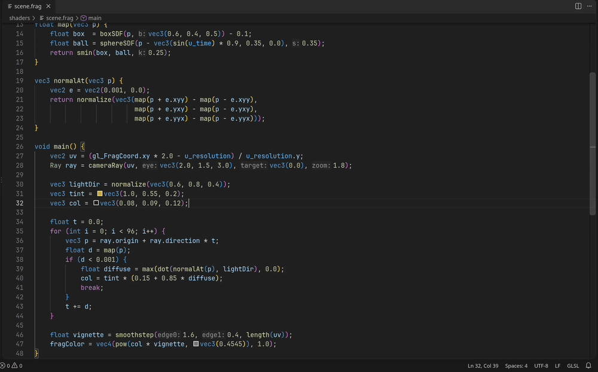
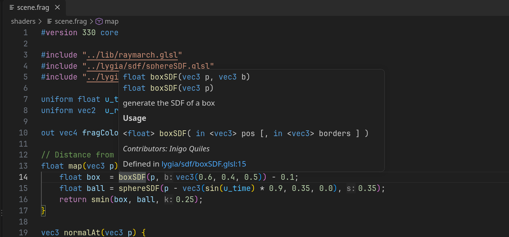
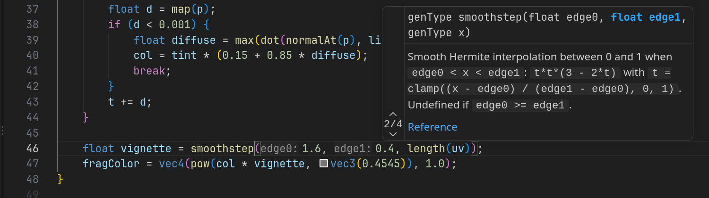
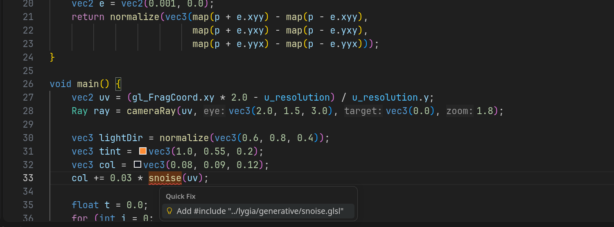
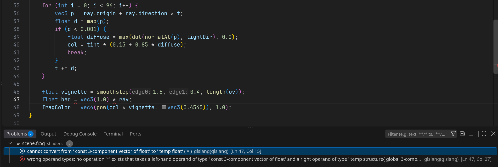
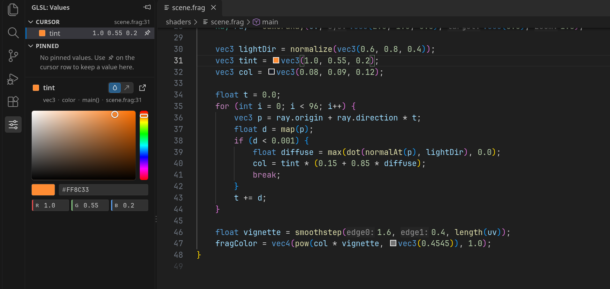
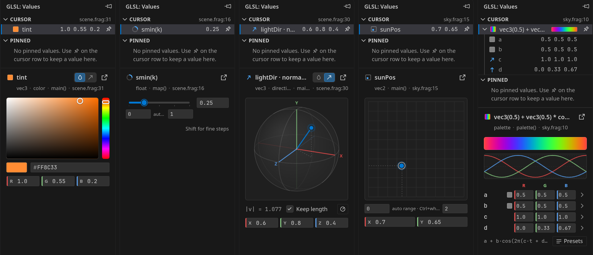
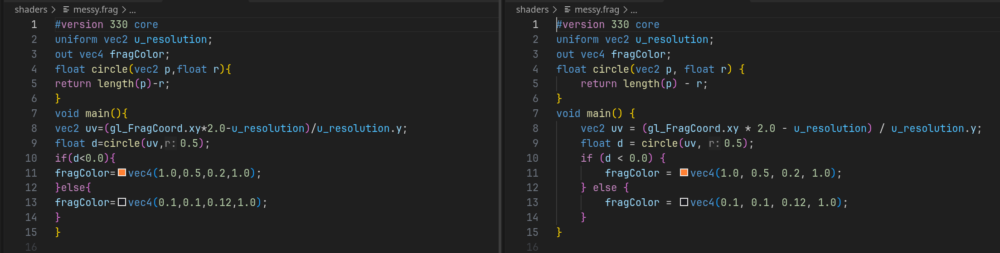

# GLSL Language Server

**Smart GLSL editing for VS Code: completion that writes your `#include`s, hover docs from your own comments, real compiler errors, and live sliders and color pickers for the numbers in your shaders.**

[](https://marketplace.visualstudio.com/items?itemName=pablodegroot.glsl-lsp) [](LICENSE)

<!-- TODO(owner): record images/hero.gif (drag a Values widget while a live shader preview updates)
     and make it the hero image here. Move autoinclude.gif down to the "Completion" feature below. -->



A language server for every kind of GLSL: OpenGL, Vulkan, WebGL and three.js, include-based libraries such as [LYGIA](https://lygia.xyz), Shadertoy, or your own engine.
It works out of the box. `glslangValidator` is optional and adds full compiler errors.

**Works with** desktop GLSL up to 4.60 · Vulkan GLSL · GLSL ES 1.00 / 3.00 (WebGL 1 / 2) · three.js · LYGIA and other `#include` libraries · Shadertoy · your own engine's uniforms

## Features

### Hover docs from your own comments

Hover a function, struct, macro or uniform to see every overload, its documentation and where it is defined. Plain `//` and `/* */` comments above a declaration are used as docs, and so are LYGIA's YAML headers. The builtins (about 180 function families and the `gl_*` variables) have docs, with a link to the Khronos reference.



### Completion that writes the `#include`

Pick a function from a file you have not included yet, and the `#include` line is added for you, with a path relative to the current file (see the animation above). Completion also covers locals, struct fields, swizzles, preprocessor directives and `#include` paths.

More: [docs/features.md](docs/features.md)

### Signature help and inlay hints

Every overload with the active parameter highlighted, including `vecN`/`matN` constructors and function-like macros. Parameter names appear inline next to literal arguments.



### Navigate and refactor across includes

Go to definition follows `#include`s into your own files and into libraries such as LYGIA. Find references and rename are scope-aware and work across files. Rename never edits read-only library folders (LYGIA by default) and says why. Ctrl+T searches every function, struct and macro in the workspace.

### Diagnostics and quick fixes

Fast checks run as you type: syntax errors, unresolved `#include`s, duplicate definitions and undeclared names. A name that lives in a file you have not included gets an *Add #include* quick fix.



With `glslangValidator` installed, complete shaders (a `main()` and a `#version` line) also get the compiler's own errors. Includes are inlined, and errors inside an included file are reported on that file.



More: [docs/diagnostics.md](docs/diagnostics.md)

### Values panel: sliders, color, vector and palette pickers

Click the **GLSL** icon in the Activity Bar to open the **Values** panel. Put the cursor on a number, vector or color and drag: the literal in your code is rewritten live, so a preview that follows the editor updates as you drag. The file is not saved, so a preview that watches the file on disk needs auto-save. Each drag is one undo step.





- **float**: slider with an editable range
- **vec2**: 2D trackpad
- **vec3 / vec4 colors**: color picker, with alpha and an intensity slider for HDR values
- **directions**: a trackball that rotates the vector
- **cosine palettes** (`a + b*cos(6.28318*(c*t+d))`): gradient, curves and presets

Pin the values you tune most and keep them at hand while you edit elsewhere. Without the panel, Ctrl+Alt+Up/Down nudges the number under the cursor.

More: [docs/values-panel.md](docs/values-panel.md)

### A formatter that respects your alignment

The default mode only fixes indentation and whitespace, so it is safe to run on save over hand-tuned shader code: aligned columns and trailing comments stay where you put them. An opinionated mode, shown below, also spaces operators and can place braces.



More: [docs/formatting.md](docs/formatting.md)

### Also

- Semantic highlighting for functions, parameters, uniforms, macros and builtins
- Outline with struct fields, and folding by braces, `#if` branches and `// region` markers
- Smart selection that expands from word to argument, call, statement and block
- Color swatches and the VS Code color picker on color literals
- Code actions to remove unused or redundant `#include`s and fix include paths

Shortcuts are written for Windows and Linux. On macOS, read Ctrl as Cmd (the nudge keys are Ctrl+Option+Up/Down).

## Quick start

1. Install **GLSL Language Server** from the Extensions view, or run `ext install pablodegroot.glsl-lsp` in Quick Open (Ctrl+P).
2. Open a `.glsl`, `.vert`, `.frag`, `.comp`, `.geom`, `.tesc`, `.tese`, `.vsh` or `.fsh` file ([and a few more](docs/configuration.md#file-extensions)). That's it.
3. *Optional:* install `glslangValidator` for full compiler errors.

   | System | Command |
   | --- | --- |
   | Debian / Ubuntu | `sudo apt install glslang-tools` |
   | Arch | `sudo pacman -S glslang` |
   | Fedora | `sudo dnf install glslang` |
   | macOS | `brew install glslang` |
   | Windows | the [Vulkan SDK](https://vulkan.lunarg.com/sdk/home), or MSYS2 `pacman -S mingw-w64-x86_64-glslang` |

   If it is not on your `PATH`, set `glslLsp.diagnostics.glslang.path`.
4. *Optional:* `#include` looks in the including file's folder and then in the workspace folder roots, so `#include "lygia/..."` works without setup. For libraries elsewhere, add their folder to `glslLsp.includePaths` (searched before the workspace roots). See [Includes](docs/configuration.md#includes).

The server is plain TypeScript bundled with the extension. There is no native binary, so it runs on Windows, macOS and Linux on any CPU, locally or over Remote.

## Use it with your engine or framework

If your runtime provides uniforms or macros the shader does not declare, tell the extension about them. They then behave like builtins: hover, completion, highlighting, no undeclared-name reports, and declarations for `glslangValidator`.

```jsonc
// .vscode/settings.json
{
  "glslLsp.environment.uniforms": [
    { "name": "u_time", "type": "float", "doc": "Seconds since start." },
    { "name": "u_lights", "type": "vec4[8]", "doc": "Light positions (xyz) and radius (w)." }
  ],
  "glslLsp.environment.defines": { "MAX_LIGHTS": "8" }
}
```

More: [Environment in docs/configuration.md](docs/configuration.md#environment)

## Shadertoy (optional)

Shadertoy-style files are recognized automatically: `iTime`, `iResolution`, `iChannel0-3` and `mainImage` are known, and `mainImage` shaders are validated inside a generated `main()`. The directives of the [shader-toy](https://marketplace.visualstudio.com/items?itemName=stevensona.shader-toy) extension (`#iChannel`, `#iUniform`, `#iKeyboard`) are understood too. That extension is not required; when it is installed, a preview button appears in the editor title bar.

More: [Shadertoy in docs/configuration.md](docs/configuration.md#shadertoy-integration-optional)

## Settings

| Setting | Default | What it does |
| --- | --- | --- |
| `glslLsp.includePaths` | `[]` | Extra folders searched by `#include` |
| `glslLsp.diagnostics.glslang.enable` | `true` | Run `glslangValidator` for compiler errors |
| `glslLsp.diagnostics.glslang.path` | `glslangValidator` | Path to the validator |
| `glslLsp.environment.uniforms` | `[]` | Uniforms your runtime provides |
| `glslLsp.environment.defines` | `{}` | Macros your runtime defines |
| `glslLsp.environment.presets` | `[]` | `["three.js"]` for three.js shaders |
| `glslLsp.shadertoy.enable` | `auto` | Where Shadertoy support applies: `auto`, `on` or `off` |
| `glslLsp.format.mode` | `conservative` | `conservative`, `opinionated` or `off` |
| `glslLsp.inlayHints.parameterNames` | `literals` | `none`, `literals` or `all` |

All 25 settings and every command are in [docs/configuration.md](docs/configuration.md), or search `@ext:pablodegroot.glsl-lsp` in the Settings editor.

## FAQ

<details>
<summary>It says <code>glslangValidator</code> was not found</summary>

Compiler checks are on by default, but the tool is optional. Install it with one of the commands in [Quick start](#quick-start) and run **GLSL: Restart Language Server**, or set `glslLsp.diagnostics.glslang.path` to its location. The notice also lets you turn compiler checks off or never see it again. Everything else works without it.

Only complete shaders are compiled: a file with `main()` and a `#version` line, or a `mainImage` shader with Shadertoy support. Other files get the fast checks only. See [docs/diagnostics.md](docs/diagnostics.md).
</details>

<details>
<summary>Does it work with Vulkan GLSL?</summary>

Yes. A shader that uses Vulkan-only GLSL (`layout(set = ...)`, `push_constant`, `subpassInput`, `gl_VertexIndex`, ...) is compiled with Vulkan rules, everything else with OpenGL rules. To choose yourself, set `glslLsp.diagnostics.glslang.targetEnv` to `opengl` or `vulkan1.0` to `vulkan1.3`. Ray tracing, mesh and task shaders are not supported yet. See [Vulkan GLSL](docs/diagnostics.md#vulkan-glsl).
</details>

<details>
<summary>three.js shaders report <code>position</code>, <code>projectionMatrix</code> and <code>#include &lt;common&gt;</code></summary>

three.js adds those names and chunks when it compiles a `ShaderMaterial`. Turn on the three.js preset:

```jsonc
"glslLsp.environment.presets": ["three.js"]
```

The uniforms and attributes three.js always adds then behave like builtins, and `#include <chunk>` lines are not reported. Declare anything else your material adds in `glslLsp.environment.uniforms`. See [three.js and other runtimes](docs/diagnostics.md#threejs-and-other-runtimes-that-inject-code).
</details>

<details>
<summary>I have another GLSL extension installed</summary>

If it also provides diagnostics or completion, you will see duplicates. Disable that extension for the workspace, or turn off its validator. If both provide syntax highlighting, only one grammar is used, depending on the order the extensions load.
</details>

<details>
<summary>My <code>.vs</code> / <code>.fs</code> files are not recognized</summary>

`.vsh`, `.fsh`, `.vshader`, `.fshader`, `.glslv`, `.glslf` and the other common shader extensions are. `.vs` and `.fs` are also used by other languages (`.fs` is F#), so they are not claimed by default. Map them in your settings; the shader stage is still taken from the extension:

```jsonc
"files.associations": { "*.vs": "glsl", "*.fs": "glsl" }
```
</details>

<details>
<summary>Ctrl+Alt+Up/Down adds cursors instead of nudging (or the other way round)</summary>

In a GLSL editor these keys nudge only when the cursor is on a number. Otherwise they fall back to the platform's default (Add Cursor Above/Below on Windows). In Remote sessions from Windows the fallback may not apply. To use other keys, rebind the four **GLSL: Increment/Decrement Number at Cursor** commands in Keyboard Shortcuts (Ctrl+K Ctrl+S). Some Windows graphics drivers take Ctrl+Alt+Arrow for screen rotation before VS Code sees it.
</details>

<details>
<summary>How do I format on save?</summary>

```jsonc
"[glsl]": {
  "editor.defaultFormatter": "pablodegroot.glsl-lsp",
  "editor.formatOnSave": true
}
```

See [docs/formatting.md](docs/formatting.md) for the modes and rules.
</details>

## Contributing

Bug reports and ideas are welcome in the [issue tracker](https://github.com/PabloDeGroot/glsl-lsp/issues). To build, test or debug the extension, see [CONTRIBUTING.md](CONTRIBUTING.md).

If the extension helps your shader work, a [rating on the Marketplace](https://marketplace.visualstudio.com/items?itemName=pablodegroot.glsl-lsp&ssr=false#review-details) helps other GLSL developers find it.

## License

[MIT](LICENSE)
